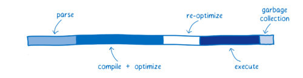
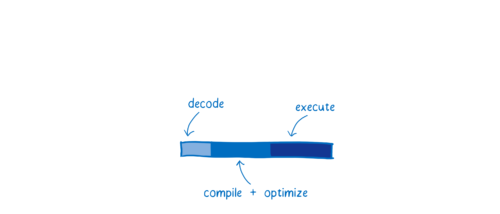

title: wasm for FE
speaker: 33
css: 
    - ./style.css

<slide class="bg-black-blue aligncenter"  .dark">

# Webassembly  {.text-landing.text-shadow}

什么是`.wasm` ? 有了`.wasm`能上天吗？ {.text-intro .ptop}

<slide class="bg-black-blue aligncenter"  .dark">

# 优点

- 快快快快 
- 可移植 
- 安全 
- 小
  {.content-left .f20 .ptop} 

<slide class="bg-black-blue aligncenter"  .dark">

# 快？！ show me the code

<slide class="bg-black-blue aligncenter"  .dark">

# 前端就这？JavaScript 就这？

! {.ptop}

[文章在这](https://mrale.ph/blog/2018/02/03/maybe-you-dont-need-rust-to-speed-up-your-js.html)

<slide class="bg-black-blue aligncenter"  .dark">

# 差距在哪里呢？

我们能够优化的唯一一点：jit 无法优化的部分(静态编译型语言 和  动态解析型语言 的区别) {.ctx .ptop} 

<slide class="bg-black-blue aligncenter"  .dark">

# wasm 快的原因

!
! {.ptop}

<slide class="bg-black-blue aligncenter"  .dark">

# webassembly 不适合做什么

性能瓶颈是浏览器的 api {.ctx .ptop .t_left} 

数据交互量大的 {.ctx .ptop .t_left}

<slide class="bg-black-blue aligncenter"  .dark">

# webassembly 适合做什么

沙盒安全类，作为容器，这里更多的是指 wasi 例如：边缘计算 {.ctx .ptop .t_left}  

提高纯密集型运算，例如：加解密算法，音视频编解码，diff 判断等 {.ctx .ptop .t_left} 

跨端云平台，重新实现前端的功能，解决胶水代码的痛点，例如：云平台搭建应用 {.ctx .ptop .t_left} 

<slide class="bg-black-blue aligncenter"  .dark">

# Q & A？
