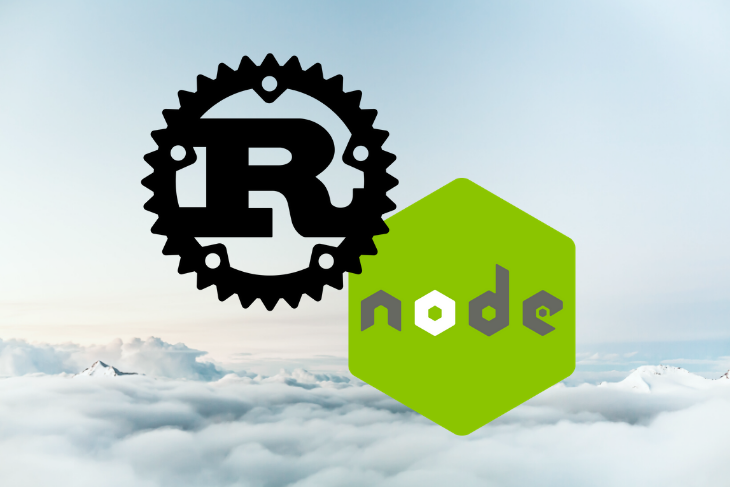
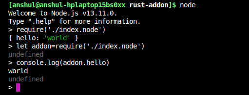
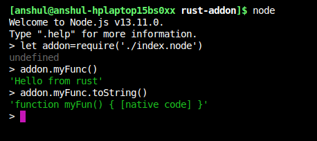
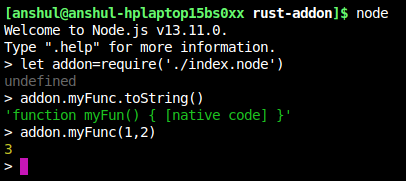
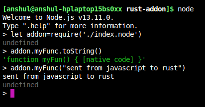

# Rust 和 Node.js：天生一对
> 原文地址：https://blog.logrocket.com/rust-and-node-js-a-match-made-in-heaven/
>
> 译者：三三
>
> 转载请标明出处



Node.js is a very popular JavaScript runtime for writing backend applications. Its flexibility and nonblocking nature have made it the premier choice for API consumption.
*Node.js* 是一门基于 *JavaScript* 运行环境的流行后端语言。灵活性与异步非阻塞让它成为了 API服务器 的首选。

Since it is a scripting language, JavaScript can be pretty slow. But thanks to V8 optimization, it is fast enough for practical applications. That said, Node.js is not good for heavy lifting; since it’s single-threaded, it is dangerous to block the main thread for doing long calculations. That’s where worker threads come in. Node.js has support for worker threads, so it can be used to perform long calculations.
因为 *JavaScript* 是一门脚本语言，所以速度很慢。但是感谢有了 V8 的优化，让它的速度足够执行一般的应用。尽管如此，Node.js 并不适合密集型工作：由于它是单线程，计算量大的情况下就会有阻塞主进程的危险。所以才有了 worker threads，用来处理大计算量的工作。

As great as worker threads are, JavaScript is still slow. Moreover, worker thread are not available in all supported LTS versions of Node. Fortunately, we can use Rust to build a native add-on for Node.js. FFI is another alternative, but it’s slower than the add-on approach. Rust is blazing fast and has fearless concurrency. Since Rust has a very small runtime (or “not runtime”), our binary size should also be pretty small.
即使有了 worker threads，JavaScript 还是很慢。而且，LTS（长期支持）版本的 Node 并不都支持 worker thread。 幸运的是，我们可以用 Rust 来构建 Node.js 原生的 add-on（插件）。FFI 则是另一种选择，只是没有 add-on 快。Rust 正在快速的发展，且拥有强大的并发性。因为 Rust 的 runtime 很小（或者说没有），所以我们编译后的二进制文件也很小。

## What is Rust?
## 什么是 Rust？

Rust is a systems programming language by Mozilla. It can call the C library by default and includes first-class support for exporting functions to C.
Rust 是一门由 Mozilla 打造的系统语言。它默认可以调用 C 的库，还可以导出支持的 first-class 的 C 函数。

Rust provides you with low-level control and high-level ergonomics. It gives you control of memory management without the hassle associated with these controls. It also delivers zero-cost abstraction, so you pay for only what you use.
Rust 提供了底层级别的操作和高级语言的特性。它可以让你省心的进行内存管理操作。它还提供了零成本的抽象，所以你可以尽情的使用它。

Rust can be called in a Node.js context via various methods. I’ve listed some of the most widely used below.
Rust 可以通过各种方法在 Node.js 的上下文中被调用。我列了一些比较常用的方法在下面。

* You can use FFI from Node.js and Rust, but this is very slow
* 你可以使用 Node.js 和 Rust 的 FFI，但这种方式速度很慢
* You can use WebAssembly to create a node_module, but all Node.js functionality is not available
* 你可以使用 WebAssembly 来创建一个 node_module，但并不是所有的 Node.js 的功能都可以用
* You can use native addons
* 你可以使用原生的插件（addons）

## What is a native addon?
## 什么是原生插件

Node.js addons are shared objects written in C++ that are dynamically linked. You can load them into Node.js using the require() function and use them as if they were ordinary Node.js modules. They primarily provide an interface between JavaScript running in Node.js and C/C++ libraries.
Node.js的插件是用 C++ 编写的共享对象，他们是动态链接的。你可以在 Node.js 中使用 require() 方法加载它，并把它当作 Node.js 的模块使用。主要的功能就是提供了在 Node.js 和 C/C++ 之间的接口。

A native addon provides a simple interface to work with another binary by loading it in V8 runtime. It is very fast and safe for making calls across the languages. Currently, Node.js supports two types of addon methods: C++ addons and N-API C++/C addons.
一个原生插件提供了一个简单的接口，可以让它在 V8 环境里加载却在另一种环境中运行。这种联通方式十分高效且安全。至今为止，Node.js 支持 2 种类型的插件：C++ 插件和 N-API C++/C 插件。

## C++ addons
## C++ 插件

A C++ addon is an object that can be mounted by Node.js and used in the runtime. Since C++ is a compiled language, these addons are very fast. C++ has a wide array of production-ready libraries that can be used to expand the Node.js ecosystem. Many popular libraries use native addons to improve performance and code quality.
C++ 插件就是一个可以挂载且运行在 Node.js 的对象。由于 C++ 是编译语言，插件的速度就会很快。而且可以用 C++ 大量的生产环境的库来扩展 Node.js 的生态圈。许多流行的库都是用原生的插件来提高性能和代码质量。

## N-API C++/C addons
## N-API C++/C 插件

The main problem with C++ addons is that you need to recompile them with every change to underlying JavaScript runtime. It causes a problem with maintaining the addon. N-API tries to eliminate this by introducing a standard application binary interface (ABI). The C header file remains backward compatible. That means you can use the addon compiled for a particular version of Node.js with any version greater than the version for which it was compiled. You would use this method to implement your addon.
C++ 插件主要的问题在于你需要重复编译，每当你改变 JavaScript 的执行环境。这会导致维护插件变得麻烦。N-API 则引入一套二进制接口标准（ABI）来规避这个问题。且 C 头文件保持向后兼容。这意味着你可以用特定版本的 Node.js 来编译插件，不需要顾虑更老的版本。你将会喜欢上这种方法来编译你的插件。

## Where does Rust come in?
## Rust 用在什么地方？

Rust can mimic the behavior of a C library. In other words, it exports the function in a format C can understand and use. Rust calls the C function to access and use APIs provided by the Node.js. These APIs provide methods for creating JavaScript strings, arrays, numbers, error, objects, functions, and more. But we need to tell Rust what these external functions, structs, pointers, etc. look like.
Rust 可以用来仿造 C 的库。或者说，它可以导出 C 风格且可以调用的函数。Rust 调用 C 函数来访问和调用 Node.js 提供的 APIs。这些 APIs 方法可以创建 JavaScript 的 strings, arrays, numbers, error, objects, functions 等。但我们需要告诉 Rust 一些必要的信息：外部函数，结构体，指针等，就像这样。

``` rust
#[repr(C)]
struct MyRustStruct {
    a: i32,
}
extern "C" fn rust_world_callback(target: *mut RustObject, a: i32) {
    println!("Function is called from C world", a);
    unsafe {
        // Do something on rust struct
        (*target).a = a;
    }
}
extern {
   fn register_callback(target: *mut MyRustStruct,
                        cb: extern fn(*mut MyRustStruct, i32)) -> i32;
   fn trigger_callback();
}
```

Rust lays down the structs in memory differently, so we need to tell it to use the style C uses. It would be a pain to create these functions by hand, so we’ll use a crate called nodejs-sys, which uses bindgen to create a nice definition for N-API.
Rust 会以不同的方式在内存中放置结构体，所以我们需要告诉它使用 C 风格的方式。手动创建这些方法会很痛苦，所以我们将会使用一个叫做 nodejs-sys 的库（crate），这个库使用了 bindgen 为 N-API 创建了一个很好的定义(原文：which uses bindgen to create a nice definition for N-API.)

bindgen automatically generates Rust FFI bindings to C and C++ libraries.
bindgen 自动生成了 Rust FFI 与 C 和 C++ 库的绑定。

Note: There will a lot of unsafe code ahead, mostly external function calls.
注意：之后将会有大量的不安全代码，主要是外部函数调用。


## Setting up your project
## 开始部署你的项目

For this tutorial, you must have Node.js and Rust installed on your system, with Cargo and npm. I would suggest using Rustup to install Rust and nvm for Node.js.
为了接下来的教程，你必须在系统里安装 Node.js 和 Rust，包括 Cargo 和 npm。我推荐使用 Rustup 来安装 Rust，Node.js 则使用 nvm 来安装。

Create a directory named rust-addon and initialize a new npm project by running npm init. Next, init a cargo project called cargo init --lib. Your project directory should look like this:
创建一个文件夹 rust-addon 并且用 `npm init` 来初始化一个项目。接着，同个文件夹用 `cargo init --lib` 来初始化一个 Rust（cargo） 项目。你的项目文件结构应该如下：

```
./rust-addon/

├── Cargo.toml
├── package.json
└── src
    └── lib.rs
```

## Configuring Rust to compile to the addon
## 设置 Rust 编译插件的配置

We need Rust to compile to a dynamic C library or object. Configure cargo to compile to the .so file on Linux, .dylib on OS X, and .dll on Windows. Rust can produce many different types of libraries using Rustc flags or Cargo.
我们需要用 Rust 来编译成一个动态的 C 库或者一个对象。配置 cargo 在 Linux 上编译成 .so 文件，在 OS X 上编程成 .dylib，还有 Windows 上的 .dll.Rust 可以通过 Rustc flags 或者 Cargo 生成多个不同的库。

``` rust
[package]
name = "rust-addon"
version = "0.1.0"
authors = ["Anshul Goyal <anshulgoel151999@gmail.com>"]
edition = "2018"
# See more keys and their definitions at https://doc.rust-lang.org/cargo/reference/manifest.html

[lib]
crate-type=["cdylib"]

[dependencies]
nodejs-sys = "0.2.0" // 最新的为0.12.0
```

The lib key provides options to configure Rustc. The name key gives the library name to the shared object in the form of lib{name}, while type provides the type of library it should be compiled to — e.g., cdylib, rlib, etc. cdylib creates a dynamically linked C library. This shared object behaves like a C library.
lib 提供了设置 Rustc 的选项。该库的对象名则会根据 name，命名为 `lib{name}`，而 crate-type 则是定义库的编程类型，例如 cdylib, rlib 等。如果是 cdylib 则会编译成动态链接的 C 库。这个共享对象就会和 C 库一样。

## Getting started with N-API
## 从 N-API 开始

Let’s create our N-API library. We need to add a dependency. nodejs-sys provides the binding required for napi-header files. napi_register_module_v1 is the entry point for the addon. The N-API documentation recommends N-API_MODULE_INIT macro for module registration, which compiles to the napi_register_module_v1 function.
让我们开始创建一个 N-API 库吧。首先添加依赖。nodejs-sys 提供了 napi-header 文件所需的绑定。napi_register_module_v1 就是插件的入口。N-API 文档推荐用 N-API_MODULE_INIT 宏来模块注册，因为这个宏会编译 napi_register_module_v1 函数。

Node.js calls this function and provides it with an opaque pointer called napi_env, which refers to the configuration of the module in JavaScript runtime, and napi_value. The latter is another opaque pointer that represents a JavaScript value, which, in reality is an object known as an export. These exports are the same as those the require function provides to the Node.js modules in JavaScript.
Node.js 调用这个函数，然后传递给它一个叫 napi_env 的不透明指针（opaque pointer），这个指针指向了在 JavaScript 运行时的模块配置，第二个不透明指针 napi_value 则是表示 JavaScript 变量，是一个导出的对象。这些导出的 “对象” 就和 JavaScript 中 require 函数提供给 Node.js 模块的 “对象” 一样。

``` rust
use nodejs_sys::{napi_create_string_utf8, napi_env, napi_set_named_property, napi_value};
use std::ffi::CString;
#[no_mangle]
pub unsafe extern "C" fn napi_register_module_v1(
    env: napi_env,
    exports: napi_value,
) -> nodejs_sys::napi_value {
// creating a C string
    let key = CString::new("hello").expect("CString::new failed");
// creating a memory location where the pointer to napi_value will be saved
    let mut local: napi_value = std::mem::zeroed();
// creating a C string
    let value = CString::new("world!").expect("CString::new failed");
// creating napi_value for the string
    napi_create_string_utf8(env, value.as_ptr(), 6, &mut local);
// setting the string on the exports object
    napi_set_named_property(env, exports, key.as_ptr(), local);
// returning the object
    exports
}
```

Rust represents owned strings with the String type and borrowed slices of strings with the str primitive. Both are always in UTF-8 encoding and may contain null bytes in the middle. If you look at the bytes that make up the string, there may be a \0 among them. Both String and str store their length explicitly; there are no null terminators at the end of strings like C strings.
Rust 用 String 类型来表示拥有权的 strings（大小可变），用字符串切片来表示借用的 str（大小固定）。两者都是采用 UTF-8 编码，且可以包含空字节。如果你查看字符串的字节，其中可能有一个 \0。String 和 str 都有明确存储自身的长度，字符串的尾端和 C 的字符串一样没有终止符。

Rust strings are very different from the ones in C, so we need to change our Rust strings to C strings before we can use then with N-API functions. Since exports is an object represented by exports, we can add functions, strings, arrays, or any other JavaScript objects as key-value pairs.
Rust 的字符串和 C 的比非常的不相同，所以我们需要在使用 N-API 函数之前，把 Rust 字符串转化成 C 的字符串。因为导出的是一个对象，所以我们可以把函数，字符串，数组等其他 JavaScript 对象当作键值对（key-value pairs）。

To add a key to a JavaScript object, you can use a method provided by the N-API napi_set_named_property. This function takes the object to which we want to add a property; a pointer to a string that will be used as the key for our property; the pointer to the JavaScript value, which can be a string, array, etc.; and napi_env, which acts an anchor between Rust and Node.js.
你可以使用 N-API 提供的 napi_set_named_property 方法来给 JavaScript 对象添加 key。这个函数接收我们要添加属性的对象，指针指向的字符串则会被用作我们属性的 key，而 JavaScript 变量的指针则可以是字符串，数组等。napi_env 则是充当了 Rust 和 Node.js 之间的锚点（anchor）。

You can use N-API functions to create any JavaScript value. For example, we used napi_create_string_utf8 here to create a string. We passed in the environment a pointer to the string, the length of string, and a pointer to an empty memory location where it can write the pointer to the newly created value. All this code is unsafe because it includes many calls to external functions where the compiler cannot provide Rust guarantees. In the end, we returned the module that was provided to us by setting a property on it with the value world!.
你可以用 N-API 的方法来创建任何的 JavaScript 的变量。例如，我们用 napi_create_string_utf8 来创建字符串。我们输入字符串的指针，字符串的长度，足够创建新变量的空内存地址指针。这里所有的代码都无法通过 Rust 编译来保证安全，因为这些东西包括了外部函数的调用。最后，我们返回的模块就能提供给我们设置的属性。

It’s important to understand that nodejs-sys just provides the required definitions for the function you’re using, not their implementation. N-API implementation is included with Node.js and you call it from your Rust code.
重点是要理解 nodejs-sys 仅仅是提供必要的定义函数给你用，它并不会执行。N-API 则会执行包括 Node.js 和你在 Rust 代码里调用的函数。

## Using the addon in Node.js
## 在 Node.js 里使用插件

The next step is to add a linking configuration for different operating systems, then you can compile it.
接下来的步骤就是给不同的系统添加链接配置，然后编译它。

Create a build.rs file to add a few configuration flags for linking the N-API files on different operating systems.
创建一个 build.rs 的文件，添加一些配置标识，为了在不同的系统里关联 N-API 文件。

``` rust
fn main() {
    println!("cargo:rustc-cdylib-link-arg=-undefined");
    if cfg!(target_os = "macos") {
        println!("cargo:rustc-cdylib-link-arg=dynamic_lookup");
    }
}
```

Your directory should look like this:
你的文件夹结构应该变成这样：

```
├── build.rs
├── Cargo.lock
├── Cargo.toml
├── index.node
├── package.json
├── src
    └── lib.rs
```

Now you need to compile your Rust addon. You can do so pretty easily using the simple command cargo build --release. This will take some time on the first run.
现在，你需要去编译你的 Rust 插件了。你可以用简单的命令行 `cargo build --release` 来编译。第一次运行可以会多花点时间。

After your module is compiled, create a copy of this binary from ./target/release/libnative.so to your root directory and rename it as index.node. The binary created by the cargo may have a different extension or name, depending on your crate setting and operating system.
等你的插件编译好之后，复制这个库 `./target/release/lib{name}.dylib(.so)` 到你的项目的根目录，并且重命名为 `index.node`。cargo 会根据你不同的设置，系统和依赖，编译出二进制文件。

Now you can require the file in Node.js and use it. You can also use it in a script. For example:
现在你可以在 Node.js 里加载和使用这个文件，你也可以在脚本里使用他，像这样：

``` js
let addon=require('./index.node');
console.log(addon.hello);
```



Next, we’ll move on to creating functions, arrays, and promises and using libuv thread-pool to perform heavy tasks without blocking the main thread.
接下来，我们会继续去创建函数，数组，还有 promise 和使用 libuv 的线程池（thread-pool）来提升重量级任务而不阻塞主线程。

## A deep dive into N-API
## 深入了解 N-API

Now you know how to implement common patterns using N-API and Rust. A very common pattern is the export function, which can be called by the user of the library or Node module. Let’s start by creating a function.
现在你知道了怎么简单的在 Rust 中使用 N-API。最常见的就是导出函数，因为它可以被用在使用者的库里或者是 Node.js 的模块里。让我们来创建这种函数吧。

You should use napi_create_function to create your functions so that you can use them from Node.js. You can add these functions as a property to exports to use from Node.js.
你可以用 napi_create_function 来创建在 Node.js 中使用的函数。你可以把这些函数添加到导出的对象属性里给 Node.js 用。

## Creating a function
## 创建一个函数

JavaScript functions are also represented by the napi_value pointer. A N-API function is pretty easy to create and use.
JavaScript 的函数也是用 napi_value 指针来表示。一个 N-API 函数是非常容易创建和使用的。

``` rust
use nodejs_sys::{
    napi_callback_info, napi_create_function, napi_create_string_utf8, napi_env,
    napi_set_named_property, napi_value,
};
use std::ffi::CString;
pub unsafe extern "C" fn say_hello(env: napi_env, _info: napi_callback_info) -> napi_value {
// creating  a javastring string
    let mut local: napi_value = std::mem::zeroed();
    let p = CString::new("Hello from rust").expect("CString::new    failed");
    napi_create_string_utf8(env, p.as_ptr(), 13, &mut local);
// returning the javascript string
    local
}
#[no_mangle]
pub unsafe extern "C" fn napi_register_module_v1(
    env: napi_env,
    exports: napi_value,
) -> nodejs_sys::napi_value {
// creating a C String
    let p = CString::new("myFunc").expect("CString::new failed");
// creating a location where pointer to napi_value be written
    let mut local: napi_value = std::mem::zeroed();
    napi_create_function(
        env,
// pointer to function name
        p.as_ptr(),
// length of function name
        5,
// rust function
        Some(say_hello),
// context which can be accessed by the rust function
        std::ptr::null_mut(),
// output napi_value
        &mut local,
    );
// set function as property
    napi_set_named_property(env, exports, p.as_ptr(), local);
// returning exports
    exports
}
```



In the above example, we created a function in Rust named say_hello, which is executed when the JavaScript calls the function. We created a function using napi_create_function, which takes the following arguments:
上面的例子里，我们在 Rust 里创建了一个叫 say_hello 做函数，当 JavaScript 调用函数（myFunc）时就会执行这个函数（say_hello）。我们用 napi_create_function 创建了一个函数，并传入下面的参数：

* The napi_env value of the environment
* napi_env 类型的的上下文的值
* A string for the function name which that be given to the JavaScript function
* 一个可以给 JavaScript 当函数名调用的字符串
* The length of the function name string
* 函数名的长度
* The function that is executed when the JavaScript calls the newly created function
* 函数本体，当 JavaScript 调用创建的函数（myFunc）时要执行的函数（say_hello）
* Context data that can be passed by the user later and accessed from the Rust function
* 上下文数据，之后可以在 Rust 函数里回传（napi_callback_info）
* An empty memory address where the pointer to the JavaScript function can be saved
* 一块空的内存地址，可以用来保存 JavaScript 函数的指针

 When you create this function, add it as a property to your exports object so that you can use it from JavaScript
当你创建完这个函数，把它添加到导出的对象上，就可以在 JavaScript 里使用它了。

The function on the Rust side must have the same signature as shown in the example. We’ll discuss next how to access arguments inside a function using napi_callback_info. We can access this from a function and other arguments as well.
这个函数在 Rust 里必需有个一样的签名，就如例子里。接下来我们将会讨论如何用 napi_callback_info 访问函数里的参数，可以从函数里和参数里访问到。

## Accessing arguments
## 传递参数

Function arguments are very important. N-API provides a method to access these arguments. napi_callback_info provides the pointer with detailed information about the function in the JavaScript side of the code.
参数在函数中起到非常重要的作用。N-API 提供一个方法来传递参数。napi_callback_info 方法提供了一个指针，存储了 JavaScript 里函数的细节。

``` rust
use nodejs_sys::{
    napi_callback_info, napi_create_double, napi_create_function, napi_env, napi_get_cb_info,
    napi_get_value_double, napi_set_named_property, napi_value,
};
use std::ffi::CString;

pub unsafe extern "C" fn add(env: napi_env, info: napi_callback_info) -> napi_value {
// creating a buffer where napi_value of argument be written
    let mut buffer: [napi_value; 2] = std::mem::MaybeUninit::zeroed().assume_init();
// max number of arguments
    let mut argc = 2 as usize;
// getting arguments and value of this
    napi_get_cb_info(
        env,
        info,
        &mut argc,
        buffer.as_mut_ptr(),
        std::ptr::null_mut(),
        std::ptr::null_mut(),
    );
// converting napi to f64
    let mut x = 0 as f64;
    let mut y = 0 as f64;
    napi_get_value_double(env, buffer[0], &mut x);
    napi_get_value_double(env, buffer[1], &mut y);
// creating the return value
    let mut local: napi_value = std::mem::zeroed();
    napi_create_double(env, x + y, &mut local);
// returning the result
    local
}

#[no_mangle]
pub unsafe extern "C" fn napi_register_module_v1(
    env: napi_env,
    exports: napi_value,
) -> nodejs_sys::napi_value {
// creating a function name
    let p = CString::new("myFunc").expect("CString::new failed");
    let mut local: napi_value = std::mem::zeroed();
// creating the function
    napi_create_function(
        env,
        p.as_ptr(),
        5,
        Some(add),
        std::ptr::null_mut(),
        &mut local,
    );
// setting function as property
    napi_set_named_property(env, exports, p.as_ptr(), local);
// returning exports
    exports
}
```



Use napi_get_cb_info to get the arguments. The following arguments must be provided:
napi_get_cb_info 函数可以获取到参数。下面是入参：

* napi_env
* napi_env
* The info pointer
* 回调函数信息的指针
* The number of expected arguments
* 参数的个数
* A buffer where arguments can be written as napi_value
* 存储参数（type：napi_value）的 buffer
* A memory location to store metadata the user provided when JavaScript function was created
* 一块内存，用来存储 JavaScript 函数创建时的 this 数据
* A memory location where this value pointer can be written
* 一块内存，用来保存变量指针

We need to create an array with memory locations where C can write a pointer to arguments and we can pass this pointer buffer to N-API function. We also get this, but we aren’t using it in this example.
我们需要创建一个内存数组，给 C 可以把参数的指针写进去，且我们可以传这个指针给 N-API 的函数。我们也可以获取到 this，但例子里我们并没有使用它。

## Working with strings arguments
## 使用字符串参数

Most of the time, you need to work with strings in JavaScript. Both creating and getting the value of a string are pretty straightforward. Use napi_get_value_string_utf8 and call this function twice: the first time to get length and second time to get the value of the string.
大部分时间，你都需要在 JavaScript 里用到字符串。创建和获取字符串都非常简单。调用两次 napi_get_value_string_utf8：第一次获取长度，第二次获取值。

``` rust
use nodejs_sys::{
    napi_callback_info, napi_create_function, napi_env, napi_get_cb_info, napi_get_undefined,
    napi_get_value_string_utf8, napi_set_named_property, napi_value,
};

use std::ffi::CString;

pub unsafe extern "C" fn print(env: napi_env, info: napi_callback_info) -> napi_value {
// creating a buffer of arguments
    let mut buffer: [napi_value; 1] = std::mem::MaybeUninit::zeroed().assume_init();
    let mut argc = 1 as usize;
// getting arguments
    napi_get_cb_info(
        env,
        info,
        &mut argc,
        buffer.as_mut_ptr(),
        std::ptr::null_mut(),
        std::ptr::null_mut(),
    );
    let mut len = 0;
// getting length by passing null buffer
    napi_get_value_string_utf8(env, buffer[0], std::ptr::null_mut(), 0, &mut len);
    let size = len as usize;
// creating a buffer where string can be placed
    let mut ve: Vec<u8> = Vec::with_capacity(size + 1);
    let raw = ve.as_mut_ptr();
// telling rust not manage the vector
    std::mem::forget(ve);
    let mut cap = 0;
// getting the string value from napi_value
    let _s = napi_get_value_string_utf8(env, buffer[0], raw as *mut i8, size + 1, &mut cap);
    let s = String::from_raw_parts(raw, cap as usize, size);
// printing the string
    println!("{}", s);
// creating an undefined
    let mut und: napi_value = std::mem::zeroed();
    napi_get_undefined(env, &mut und);
// returning undefined
    und
}

#[no_mangle]
pub unsafe extern "C" fn napi_register_module_v1(
    env: napi_env,
    exports: napi_value,
) -> nodejs_sys::napi_value {
    let p = CString::new("myFunc").expect("CString::new failed");
    let mut local: napi_value = std::mem::zeroed();
    napi_create_function(
        env,
        p.as_ptr(),
        5,
        Some(print),
        std::ptr::null_mut(),
        &mut local,
    );
    napi_set_named_property(env, exports, p.as_ptr(), local);
    exports
}
```



You’ll need to pass a few arguments to napi_create_string_utf8 to create a string. If a null pointer is passed as a buffer, the length of the string is given. The following arguments are required:
你将需要传递一些参数给 napi_create_string_utf8 来创建字符串。如果 buffer 传的是空指针，你会得到的是字符串的长度。下面就是必要的参数：

* napi_env
* napi_env
* napi_value pointer to the string in javascript side
* 一个指向 JavaScript 字符串的指针
* The buffer where the string is to be written if null gives the length of the string
* 一块缓存区，如果是空的则返回字符串长度
* The length of the buffer
* 缓存区的长度
* Bytes written to the buffer
* 写入数据的缓存区

## Working with promises and libuv thread pool
## 使用 promise 和 libuv 线程池

It’s not a good idea to block the main thread of Node.js for doing calculations. You can use libuv threads to do the heavy lifting.
主线程因运行大量计算而阻塞并不是一件好事。你可以用 libuv 的线程去做这些笨重的事。

First, create a promise. The promise will reject or resolve based on the success of your work. For this, you’ll need to create three functions. The first one is called from the JavaScript world and the control would be passed to the second function, which runs on libuv thread and has no access to JavaScript. The third function, which does have access to the JavaScript side, is called after the second finishes. You can use the napi_create_async_work method for the libuv thread.
首先是创建一个 promise。promise 会根据你的状态，执行 reject 或者 resolve。这样，你就需要创建三个函数。第一个函数是在 JavaScript 里被调用的，然后控制权将会转移到第二个函数，第二个函数就运行在 libuv 线程里且没有访问 JavaScript 的权利。第三个函数则可以在第二个函数完成时被调用，访问到 JavaScript。你可以使用napi_create_async_work 来完成 libuv 线程。

## Creating a promise
## 创建 promise

To create a promise, simply use napi_create_promise. This will provide a pointer, napi_deferred, which can then resolve or reject a promise using the following functions:
用 napi_create_promise 就可以简单的创建一个 promise 了。它会提供给你一个指针和 napi_deferred，napi_deferred 可以用下面的函数来处理 promise 的 resolve 和 reject。

* napi_resolve_deferred
* napi_reject_deferred

## Error handling
## 错误处理

You can create and throw an error from the Rust code using napi_create_error and napi_throw_error. Every N-API function returns a napi_status, which should be checked.
你可以使用 napi_create_error 和 napi_throw_error 来在 Rust 里创建并抛出错误。所有的 N-API 函数都会返回一个需要被检测的状态值 napi_status。

## Real code
## Don't BB, Show me the code

The following example shows how to schedule async work.
下面的例子就是实现了一个异步工作流

``` rust
use nodejs_sys::{
    napi_async_work, napi_callback_info, napi_create_async_work, napi_create_error,
    napi_create_function, napi_create_int64, napi_create_promise, napi_create_string_utf8,
    napi_deferred, napi_delete_async_work, napi_env, napi_get_cb_info, napi_get_value_int64,
    napi_queue_async_work, napi_reject_deferred, napi_resolve_deferred, napi_set_named_property,
    napi_status, napi_value,
};
use std::ffi::c_void;
use std::ffi::CString;

#[derive(Debug, Clone)]
struct Data {
    deferred: napi_deferred,
    work: napi_async_work,
    val: u64,
    result: Option<Result<u64, String>>,
}

pub unsafe extern "C" fn feb(env: napi_env, info: napi_callback_info) -> napi_value {
    let mut buffer: Vec<napi_value> = Vec::with_capacity(1);
    let p = buffer.as_mut_ptr();
    let mut argc = 1 as usize;
    std::mem::forget(buffer);
    napi_get_cb_info(
        env,
        info,
        &mut argc,
        p,
        std::ptr::null_mut(),
        std::ptr::null_mut(),
    );
    let mut start = 0;
    napi_get_value_int64(env, *p, &mut start);
    let mut promise: napi_value = std::mem::zeroed();
    let mut deferred: napi_deferred = std::mem::zeroed();
    let mut work_name: napi_value = std::mem::zeroed();
    let mut work: napi_async_work = std::mem::zeroed();
    let async_name = CString::new("async fibonaci").expect("Error creating string");
    napi_create_string_utf8(env, async_name.as_ptr(), 13, &mut work_name);
    napi_create_promise(env, &mut deferred, &mut promise);
    let v = Data {
        deferred,
        work,
        val: start as u64,
        result: None,
    };
    let data = Box::new(v);
    let raw = Box::into_raw(data);
    napi_create_async_work(
        env,
        std::ptr::null_mut(),
        work_name,
        Some(perform),
        Some(complete),
        std::mem::transmute(raw),
        &mut work,
    );
    napi_queue_async_work(env, work);
    (*raw).work = work;
    promise
}

pub unsafe extern "C" fn perform(_env: napi_env, data: *mut c_void) {
    let mut t: Box<Data> = Box::from_raw(std::mem::transmute(data));
    let mut last = 1;
    let mut second_last = 0;
    for _ in 2..t.val {
        let temp = last;
        last = last + second_last;
        second_last = temp;
    }
    t.result = Some(Ok(last));
    Box::into_raw(task);
}

pub unsafe extern "C" fn complete(env: napi_env, _status: napi_status, data: *mut c_void) {
    let t: Box<Data> = Box::from_raw(std::mem::transmute(data));
    let v = match t.result {
        Some(d) => match d {
            Ok(result) => result,
            Err(_) => {
                let mut js_error: napi_value = std::mem::zeroed();
                napi_create_error(
                    env,
                    std::ptr::null_mut(),
                    std::ptr::null_mut(),
                    &mut js_error,
                );
                napi_reject_deferred(env, t.deferred, js_error);
                napi_delete_async_work(env, t.work);
                return;
            }
        },
        None => {
            let mut js_error: napi_value = std::mem::zeroed();
            napi_create_error(
                env,
                std::ptr::null_mut(),
                std::ptr::null_mut(),
                &mut js_error,
            );
            napi_reject_deferred(env, t.deferred, js_error);
            napi_delete_async_work(env, t.work);
            return;
        }
    };
    let mut obj: napi_value = std::mem::zeroed();
    napi_create_int64(env, v as i64, &mut obj);
    napi_resolve_deferred(env, t.deferred, obj);

    napi_delete_async_work(env, t.work);
}

#[no_mangle]
pub unsafe extern "C" fn napi_register_module_v1(
    env: napi_env,
    exports: napi_value,
) -> nodejs_sys::napi_value {
    let p = CString::new("myFunc").expect("CString::new failed");
    let mut local: napi_value = std::mem::zeroed();
    napi_create_function(
        env,
        p.as_ptr(),
        5,
        Some(feb),
        std::ptr::null_mut(),
        &mut local,
    );
    napi_set_named_property(env, exports, p.as_ptr(), local);
    exports
}
```

We created a struct to store a pointer to our napi_async_work and napi_deferred as well as our output. Initially, the output is None. Then we created a promise, which provides a deferred that we save in our data. This data is available to us in all of our functions.
我们创建了一个结构体来存储指向 napi_async_work ，napi_deferred 和输出结果的指针。最开始，输出结果为 None。然后我们创建了一个 promise 来提供一个 deferred，用于储存我们输出的数据。这个结构体可以用于我们所有的函数里。

Next, we converted our data into raw data and pass it to the napi_create_async_work function with other callbacks. We returned the promise we created, executed perform, and converted our data back to struct.
接下来，我们把数据转换到 raw 数据里，然后当做其他回调参数传给 napi_create_async_work 函数。我们返回我们创建的 promise，执行 perform，把我们的数据转换回结构体。

Once perform is completed on libuv thread, complete is called from the main thread, along with the status of the previous operation and our data. Now we can reject or resolve our work and delete work from the queue.
一旦 perform 在 libuv 线程里完成，complete 就会在主线程里被调用，带着上一步的状态值和我们的数据。现在我们可以 reject 或者 resolve 我们的流程，然后从队列里删除工作流了。

## Let’s walk through the code
## 让我们看看这代码吧

Create a function called feb, which will be exported to JavaScript. This function will return a promise and schedule work for the libuv thread pool.
创建一个叫做 feb 的函数，它将会被导出到 JavaScript 里。这个函数会返回一个在 libuv 线程池里执行的 promise。

You can achieve this by creating a promise, using napi_create_async_work, and passing two functions to it. One is executed on the libuv thread and the other on the main thread.
你要创建这么一个 promise 的话，需要用到 napi_create_async_work ，然后传两个函数给它。一个在 libuv 里执行，另一个在主线程里执行。

Since you can only execute JavaScript from the main thread, you must resolve or reject a promise only from the main thread. The code includes a large number of unsafe functions.
由于你只能在主线程里执行 JavaScript，所以你必须在主线程里 resolve 或者 reject 一个 promise。这段代码里包含了大量的不安全函数。

## feb function

``` rust
pub unsafe extern "C" fn feb(env: napi_env, info: napi_callback_info) -> napi_value {
    let mut buffer: Vec<napi_value> = Vec::with_capacity(1);
    let p = buffer.as_mut_ptr();
    let mut argc = 1 as usize;
    std::mem::forget(buffer);
// getting arguments for the function
    napi_get_cb_info(
        env,
        info,
        &mut argc,
        p,
        std::ptr::null_mut(),
        std::ptr::null_mut(),
    );
    let mut start = 0;
// converting the napi_value to u64 number
    napi_get_value_int64(env, *p, &mut start);
// promise which would be returned
    let mut promise: napi_value = std::mem::zeroed();
// a pointer to promise to resolve is or reject it
    let mut deferred: napi_deferred = std::mem::zeroed();
// a pointer to our async work name used for debugging
    let mut work_name: napi_value = std::mem::zeroed();
// pointer to async work
    let mut work: napi_async_work = std::mem::zeroed();
    let async_name = CString::new("async fibonaci").expect("Error creating string");
// creating a string for name
    napi_create_string_utf8(env, async_name.as_ptr(), 13, &mut work_name);
// creating a promise
    napi_create_promise(env, &mut deferred, &mut promise);
    let v = Data {
        deferred,
        work,
        val: start as u64,
        result: None,
    };
// creating a context which can be saved to share state between our functions
    let data = Box::new(v);
// converting it to raw pointer
    let raw = Box::into_raw(data);
// creating the work
    napi_create_async_work(
        env,
        std::ptr::null_mut(),
        work_name,
        Some(perform),
        Some(complete),
        std::mem::transmute(raw),
        &mut work,
    );
// queuing to execute the work
    napi_queue_async_work(env, work);
// setting pointer to work that can be used later
    (*raw).work = work;
// retuning the pormise
    promise
}
```

## perform function

``` rust
pub unsafe extern "C" fn perform(_env: napi_env, data: *mut c_void) {
// getting the shared data and converting the in box
    let mut t: Box<Data> = Box::from_raw(std::mem::transmute(data));
    let mut last = 1;
    let mut second_last = 0;
    for _ in 2..t.val {
        let temp = last;
        last = last + second_last;
        second_last = temp;
    }
// setting the result on shared context
    t.result = Some(Ok(last));
// telling the rust to not to drop the context data
    Box::into_raw(t);
}
```

## complete function

``` rust
pub unsafe extern "C" fn complete(env: napi_env, _status: napi_status, data: *mut c_void) {
// getting the shared context
    let t: Box<Data> = Box::from_raw(std::mem::transmute(data));
    let v = match task.result {
        Some(d) => match d {
            Ok(result) => result,
            Err(_) => {
// if there is error just throw an error
// creating error
                let mut js_error: napi_value = std::mem::zeroed();
                napi_create_error(
                    env,
                    std::ptr::null_mut(),
                    std::ptr::null_mut(),
                    &mut js_error,
                );
// rejecting the promise with error
                napi_reject_deferred(env, task.deferred, js_error);
// deleting the task from the queue
                napi_delete_async_work(env, task.work);
                return;
            }
        },
        None => {
// if no result is found reject with error
// creating an error
            let mut js_error: napi_value = std::mem::zeroed();
            napi_create_error(
                env,
                std::ptr::null_mut(),
                std::ptr::null_mut(),
                &mut js_error,
            );
// rejecting promise with error
            napi_reject_deferred(env, task.deferred, js_error);
// deleting the task from queue
            napi_delete_async_work(env, task.work);
            return;
        }
    };
// creating the number
    let mut obj: napi_value = std::mem::zeroed();
    napi_create_int64(env, v as i64, &mut obj);
// resolving the promise with result
    napi_resolve_deferred(env, t.deferred, obj);
// deleting the work
    napi_delete_async_work(env, t.work);
}
```

## Conclusion
## 结尾

When it comes to what you can do with N-API, this is just the tip of the iceberg. We went over a few patterns and covered the basics, such as how to export functions, create oft-used JavaScript types such as strings, numbers, arrays, objects, etc., get the context of a function (i.e., get the arguments and this in a function), etc.
关于 N-API 可以用在什么地方，这里只是冰山一角。我们介绍了一些实现的步骤和基础知识，例如：如何导出函数，创建 JavaScript 类型的字符串，数字，数组，对象等，获取函数的上下文等（获取函数的参数）。

We also examined an in-depth example of how to use libuv threads and create an async_work to perform heavy calculations in the background. Finally, we created and used JavaScript’s promises and learned how to do error handling in N-APIs.
我们还深度解析了一个例子：如何利用 libuv 线程，在后台创建一个 async_work 来解决大计算量的任务。最后，我们创建和使用到了 JavaScript 的 promise，还有学到了如何在 N-API 里处理错误。

There are many libraries available if you don’t want to write all the code by hand. These provide nice abstractions, but the downside is that they don’t support all features.
这里有许多库可以帮你精简代码量。它们提供了不错的抽象，不足的是它们并不支持所有的特性。

* [neon](https://github.com/neon-bindings/neon)
* [node-bindgen](https://github.com/infinyon/node-bindgen)
* [napi-rs](https://github.com/napi-rs/napi-rs)